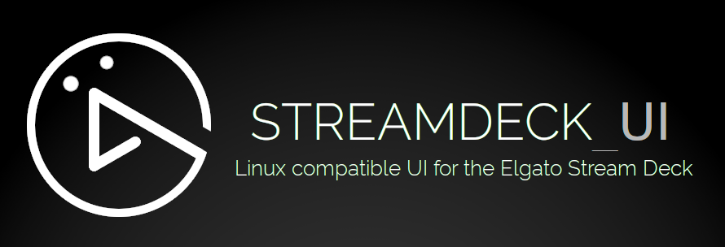
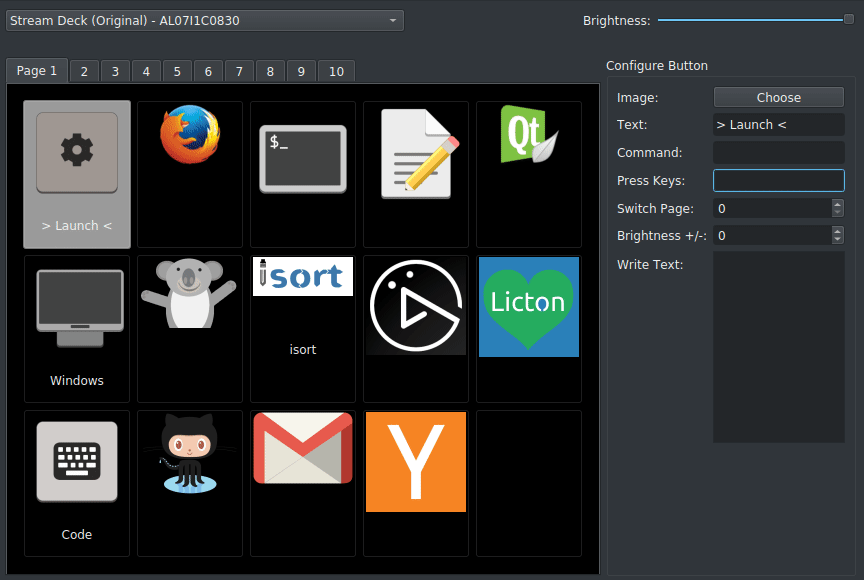

_________________

_________________

**streamdeck-gui-ng** - Next Generation Linux compatible UI for the Elgato Stream Deck.

## Why This Fork?

I use Stream Deck every day and depend on it for my workflow. When I noticed that streamdeck-linux-gui had entered maintenance mode and was no longer accepting new features, I decided to fork it to ensure continued development and modernization.

This fork aims to:

- Modernize the codebase with support for current Python versions (3.11+)
- Fix security vulnerabilities and keep dependencies up to date
- Continue active development and feature improvements
- Maintain compatibility with the latest Stream Deck devices

## Project History

**streamdeck-gui-ng** is the third generation of this project:

1. **[streamdeck_ui](https://github.com/timothycrosley/streamdeck-ui)** (Original) - Created by Timothy Crosley, this was the first Linux UI for Stream Deck. The project was abandoned when the original author disappeared.

2. **[streamdeck-linux-gui](https://github.com/streamdeck-linux-gui/streamdeck-linux-gui)** (First Fork) - The community forked the original project to keep it alive. However, this fork eventually entered maintenance mode in 2024, accepting only critical bug fixes while directing users to [StreamController](https://github.com/StreamController/StreamController) for new features.

3. **streamdeck-gui-ng** (This Fork) - A modernized continuation for users who prefer the original architecture and want continued development of this proven codebase.

All credit to the original authors and the many contributors to both previous projects. This fork builds on their excellent work.

## Key Features

- **Linux Compatible**: Enables usage of Stream Deck devices (Original, MK2, Mini and XL) on Linux.
- **Multi-device**: Enables connecting and configuring multiple Stream Decks on one computer.
- **Brightness Control**: Supports controlling the brightness from both the configuration UI and buttons on the device itself.
- **Configurable Button Display**: Icons + Text, Icon Only, and Text Only configurable per button on the Stream Deck.
- **Multi-Action Support**: Run commands, write text and press hotkey combinations at the press of a single button on your Stream Deck.
- **Button Pages**: streamdeck_ui supports multiple pages of buttons and dynamically setting up buttons to switch between those pages.
- **Auto Reconnect**: Automatically and gracefully reconnects, in the case the device is unplugged and replugged in.
- **Import/Export**: Supports saving and restoring Stream Deck configuration.
- **Drag/Drop**: Move buttons by simply drag and drop.
- **Drag/Drop Image**: Configure a button image by dragging it from your file manager onto the button.
- **Auto Dim**: Configure the Stream Deck to automatically dim the display after a period of time. A button press wakes it up again.
- **Animated icons**: Use an animated gif to liven things up a bit.
- **Runs under systemd**: Run automatically in the background as a systemd --user service.
- **Stream Deck Pedal**: Supports actions when pressing pedals.

# Documentation

Communication with the Stream Deck is powered by the [Python Elgato Stream Deck Library](https://github.com/abcminiuser/python-elgato-streamdeck#python-elgato-stream-deck-library).

Documentation is available at [https://millaguie.github.io/streamdeck-gui-ng/](https://millaguie.github.io/streamdeck-gui-ng/)

## Installation Guides

- [Arch/Manjaro](docs/installation/arch.md)
- [CentOS](docs/installation/centos.md)
- [Fedora](docs/installation/fedora.md)
- [NixOS](docs/installation/nixos.md)
- [openSUSE](docs/installation/opensuse.md)
- [Ubuntu/Mint](docs/installation/ubuntu.md)

Once you're up and running, consider installing a [systemd service](docs/installation/systemd.md).

> Use the [troubleshooting](docs/troubleshooting.md) guide or [search](https://github.com/millaguie/streamdeck-gui-ng/issues?q=is%3Aissue) the issues for guidance. If you cannot find on the issue on this repository please try searching on the original at [streamdeck_ui](https://github.com/timothycrosley/streamdeck-ui/issues?q=is%3Aissue++).

### Precooked Scripts

There are scripts for setting up streamdeck_ui on [Debian/Ubuntu](scripts/ubuntu_install.sh) and [Fedora](scripts/fedora_install.sh).

## Updating Documentation

Documentation is powered by mkdocs-material, and its on the [docs](docs/) folder. Install it with `pip install mkdocs-material` and run `mkdocs serve` to see the changes locally, before submitting a PR.

## Development & Contributions

Contributuions encouraged and very welcome, however some rules and guidelines must be followed!

### General Guidelines

- The project is versioned according to [Semantic Versioning](https://semver.org/).
- When writing your commit messages, please follow the [Angular commit message](https://gist.github.com/brianclements/841ea7bffdb01346392c).
- Pull requests should be made against the `develop` branch, so please make sure you check out the `develop` branch.
- Pull requests should include tests and documentation as appropriate.
- When opening a pull request, if possible, attach a screenshot or GIF of the changes.
- Please read the [contributing guide](https://github.com/millaguie/streamdeck-gui-ng/blob/main/docs/contributing/contributing-guide.md) for more information and instructions on how to get started.

### Feature Requests

Open a new discussion with the `feature request` tag and describe the feature you would like to see implemented. If you have a screenshot or GIF of the feature, please attach it to the discussion.

### Bug Reports

Open a [bug report](https://github.com/millaguie/streamdeck-gui-ng/issues) and follow the template. Please include as much information as possible.

### Have a Question?

If you need any help, have a question, or just want to discuss something related to the project, please feel free to open a [discussion](https://github.com/millaguie/streamdeck-gui-ng/discussions).

## Known issues

- pip package is not yet available for the current state of the project. Please install from source, currently trying to find a better way to provide the package.
- Streamdeck uses [pynput](https://github.com/moses-palmer/pynput) for simulating **Key Presses** but it lacks proper [support for Wayland](https://github.com/moses-palmer/pynput/issues/189). Generally your results will be good when using X (Ubuntu/Linux Mint). [This thread](https://github.com/timothycrosley/streamdeck-ui/issues/47) may be useful.
- **Key Press** or **Write Text** does not work on Fedora (outside of the streamdeck itself), which is not particularly useful. However, still do a lot with the **Command** feature.
- Some users have reported that the Stream Deck device does not work on all on specific USB ports, as it draws quite a bit of power and/or has [strict bandwidth requirements](https://github.com/timothycrosley/streamdeck-ui/issues/69#issuecomment-715887397). Try a different port.
- If you are executing a shell script from the Command feature - remember to add the shebang at the top of your file, for the language in question. `#!/bin/bash` or `#!/usr/bin/python3` etc. The streamdeck may appear to lock up if you don't under some distros.
